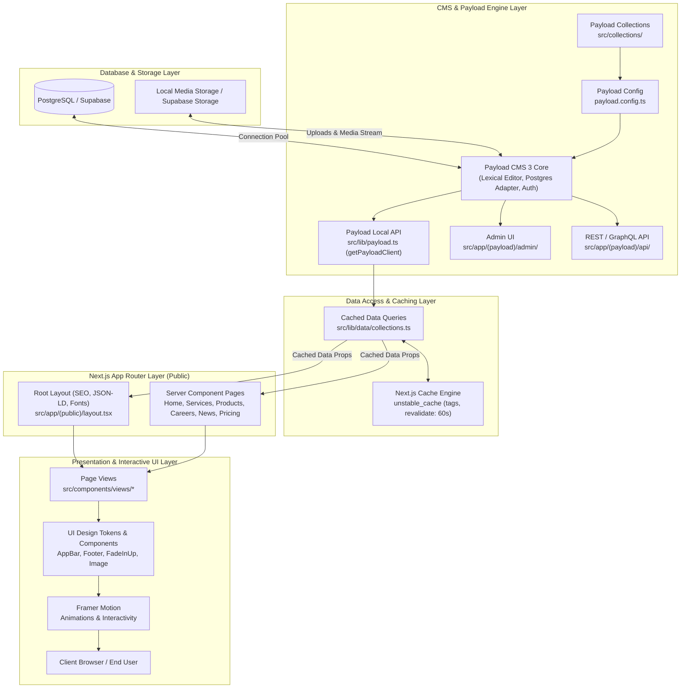

# Pola Arsitektur (Architecture Pattern)

Dokumen ini menjelaskan konsep arsitektur, pemisahan layer, dan alur data yang diterapkan pada proyek **MiraiSoftNet Company Profile**.

---

## Filosofi: Headless Fullstack Architecture

Aplikasi ini dibangun menggunakan arsitektur **Headless Fullstack** modern yang memadukan **Next.js 16 (App Router)** sebagai framework aplikasi web fullstack dan **PayloadCMS 3** sebagai Content Management System (CMS) terintegrasi:

1. **Monolithic Repo, Decoupled Concerns**: Frontend publik dan CMS backend berada dalam satu repository codebase yang sama, namun terpisah secara logis melalui Route Groups Next.js (`(public)` vs `(payload)`).
2. **Payload Local API (Zero-Overhead)**: Server Components Next.js berkomunikasi langsung dengan database PostgreSQL melalui *Payload Local API* (`getPayloadClient()`), menghilangkan overhead HTTP round-trip internal.
3. **Server-First & Granular Caching**: Data fetching dilakukan di sisi server (React Server Components) dengan akselerasi cache bertingkat (`unstable_cache`) dan mekanisme tag-based revalidation.
4. **End-to-End Type Safety**: Skema koleksi CMS diekspor langsung menjadi definisi tipe TypeScript (`payload-types.ts`), memberikan jaminan type safety dari level database hingga komponen UI.

---

## Diagram Arsitektur & Alur Data

Berikut diagram alur data standar dari database PostgreSQL hingga dirender ke antarmuka pengguna di browser:

---

## Penjelasan Setiap Layer

### 1. Presentation & UI Layer (`src/components/views/` & `src/components/ui/`)

- **Tanggung Jawab**: Merender tampilan visual yang elegan, responsif, dan interaktif sesuai brand identity MiraiSoftNet.
- **Karakteristik**:
  - Dibangun dengan **Tailwind CSS v4** dengan palet warna terstandarisasi.
  - Komponen dinamis yang membutuhkan interaksi pengguna atau animasi stateful ditandai dengan directive `'use client'`.
  - Menggunakan **Framer Motion** untuk efek micro-interaction, transisi antar bagian, dan `FadeInUp`.
  - Komponen global seperti [AppBar.tsx](file:///c:/repository/compro_mirai/src/components/ui/AppBar.tsx) dan [Footer.tsx](file:///c:/repository/compro_mirai/src/components/ui/Footer.tsx) menerima data produk dan layanan dinamis langsung dari server.

### 2. App Router Layer (`src/app/(public)/`)

- **Tanggung Jawab**: Menangani routing halaman, optimasi SEO, metadata OpenGraph, structured data (JSON-LD), dan layout komposisi.
- **Karakteristik**:
  - Menggunakan konvensi Next.js App Router dengan route group `(public)` agar terisolasi dari rute admin CMS `(payload)`.
  - Mayoritas page adalah **React Server Components (RSC)** yang mengeksekusi pengambilan data secara paralel (`Promise.all`) di server.
  - Menyediakan fallback UX seperti `loading.tsx` saat streaming konten.

### 3. Data Access & Caching Layer (`src/lib/data/collections.ts` & `src/lib/payload.ts`)

- **Tanggung Jawab**: Menyediakan abstraksi fungsi pengambilan data yang aman, efisien, dan ter-cache.
- **Karakteristik**:
  - Menggunakan `getPayloadClient()` yang menerapkan pola **Singleton** untuk membagi satu instance Payload client di seluruh request.
  - Membungkus query Payload dalam `unstable_cache` dari Next.js dengan tag khusus (misalnya `["services"]`, `["products"]`) dan durasi TTL (`revalidate: 60`).
  - Memfasilitasi pengambilan data relasional dengan kedalaman yang ditentukan (`depth: 1` atau `depth: 2`).

### 4. CMS & Schema Layer (`src/collections/` & `payload.config.ts`)

- **Tanggung Jawab**: Mengelola konten dinamis, skema data, hak akses, validasi field, dan media uploads.
- **Karakteristik**:
  - Skema dideklarasikan sebagai file TypeScript terpisah per entitas di `src/collections/`.
  - Menggunakan Lexical Rich Text Editor untuk konten artikel, portofolio, dan deskripsi detail layanan.
  - Dilengkapi lifecycle hooks seperti `beforeValidate` untuk otomatis menghasilkan URL slug yang ramah SEO via `generateSlug()`.

### 5. Database & Persistence Layer

- **Tanggung Jawab**: Penyimpanan relasional persisten dan pooling koneksi database.
- **Karakteristik**:
  - Menggunakan adapter PostgreSQL `@payloadcms/db-postgres` yang terhubung ke PostgreSQL / Supabase melalui `DATABASE_URI`.
  - Media file dikelola melalui koleksi `Media.ts` dengan dukungan optimasi gambar `sharp`.

---

## Keunggulan Pola Arsitektur Ini

| Aspek | Manfaat dalam Proyek Ini |
| :--- | :--- |
| **Zero Internal HTTP Overhead** | Server component memanggil database langsung via Payload Local API tanpa perlu melakukan `fetch('https://...')` ke diri sendiri. |
| **SEO Maksimal** | Halaman dirender di server dengan metadata dinamis, OpenGraph, sitemap dinamis (`src/app/sitemap.ts`), dan JSON-LD schema. |
| **Efisiensi Beban Database** | `unstable_cache` memastikan query berulang disajikan langsung dari memory cache Next.js, menjaga performa tetap cepat di bawah trafik tinggi. |
| **Type Safety Menyeluruh** | Semua koleksi CMS otomatis di-generate menjadi tipe TypeScript sehingga meminimalisir bug runtime pada frontend. |
