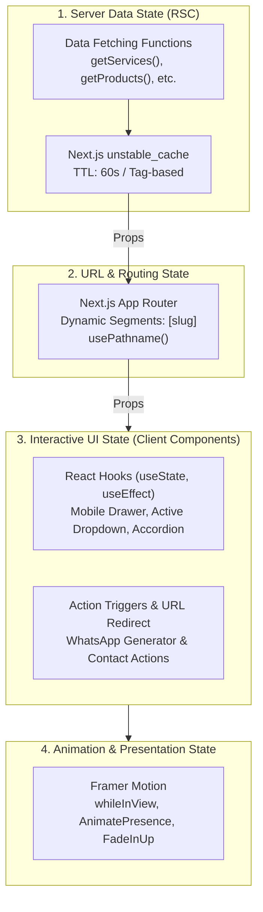

# Manajemen State & Reaktivitas (State Management)

Dokumen ini menjelaskan pola pengelolaan state, reaktivitas komponen, dan strategi animasi yang diterapkan pada proyek **MiraiSoftNet Company Profile (Next.js 16 & React 19)**.

---

## Filosofi: Server-First & Minimalist Client State

Pada aplikasi Company Profile modern berbasis Next.js App Router, kebutuhan state management berbeda dari Single Page Application (SPA) tradisional:

1. **Stateless by Default (Server Components)**: Sebagian besar halaman adalah React Server Components (RSC) yang stateless. Data diambil di server dan dialirkan ke komponen tampilan dalam bentuk *typed immutable props*.
2. **Tanpa Overhead Global Store**: Tidak memerlukan library state management eksternal yang berat (seperti Redux atau MobX). Kebutuhan data global ditangani langsung oleh Server Layout dan Server Data Caching.
3. **Isolasi State Interaktif**: Directive `'use client'` hanya digunakan pada komponen yang benar-benar membutuhkan interaksi pengguna (seperti menu navigasi responsif, accordion FAQ, atau kontrol animasi).

---

## 4 Lapisan State dalam Aplikasi



---

## 1. Server Data State & Caching

Data bisnis utama (layanan, produk, karir, berita) dikelola di sisi server dengan `unstable_cache`.

### Karakteristik

- **Immutable**: Komponen UI tidak pernah memutasi data ini secara langsung di browser.
- **Konsisten**: Data di-*share* secara efisien dari `layout.tsx` ke [AppBar.tsx](file:///c:/repository/compro_mirai/src/components/ui/AppBar.tsx) dan [Footer.tsx](file:///c:/repository/compro_mirai/src/components/ui/Footer.tsx).
- **Auto Revalidasi**: Data diperbarui di latar belakang setiap 60 detik atau on-demand menggunakan tag cache.

---

## 2. Interactive Client State (React 19 Hooks)

Komponen interaktif menggunakan standard hooks dari React 19.

### Contoh Kasus: Navigasi AppBar (`src/components/ui/AppBar.tsx`)

Komponen navigasi mengelola state drawer mobile, dropdown aktif, dan deteksi scroll untuk mengubah tampilan navbar:

```tsx
"use client";

import { useState, useEffect } from "react";
import type { Service, Product } from "@/../payload-types";

interface AppBarProps {
  services: Service[];
  products: Product[];
}

export default function AppBar({ services, products }: AppBarProps) {
  // State untuk drawer mobile
  const [isMobileMenuOpen, setIsMobileMenuOpen] = useState(false);
  
  // State untuk deteksi scroll navbar transparan ke solid
  const [isScrolled, setIsScrolled] = useState(false);

  useEffect(() => {
    const handleScroll = () => {
      setIsScrolled(window.scrollY > 20);
    };
    window.addEventListener("scroll", handleScroll);
    return () => window.removeEventListener("scroll", handleScroll);
  }, []);

  return (
    <header className={`fixed top-0 w-full z-50 transition-all ${isScrolled ? "bg-white shadow-md" : "bg-transparent"}`}>
      {/* Render navigasi desktop & tombol hamburger mobile */}
    </header>
  );
}
```

### Contoh Kasus: Accordion FAQ Interaktif

Komponen FAQ mengelola indeks item pertanyaan yang sedang terbuka:

```tsx
"use client";

import { useState } from "react";
import type { Faq } from "@/../payload-types";

export default function FaqAccordion({ items }: { items: Faq[] }) {
  const [openId, setOpenId] = useState<string | null>(null);

  const toggle = (id: string) => {
    setOpenId((prev) => (prev === id ? null : id));
  };

  return (
    <div className="space-y-4">
      {items.map((item) => (
        <div key={item.id} className="border rounded-lg p-4">
          <button onClick={() => toggle(item.id)} className="w-full flex justify-between font-medium">
            <span>{item.question}</span>
            <span>{openId === item.id ? "−" : "+"}</span>
          </button>
          {openId === item.id && (
            <div className="mt-2 text-gray-600 text-sm">{item.answer}</div>
          )}
        </div>
      ))}
    </div>
  );
}
```

---

## 3. Animation State (Framer Motion)

Animasi ditangani secara deklaratif menggunakan **Framer Motion 12**, memastikan render performan tinggi tanpa *jank*.

### Standar Animasi: `src/components/ui/FadeInUp.tsx`

Setiap section halaman dibungkus dengan komponen `FadeInUp` untuk transisi halus saat elemen masuk ke viewport pengguna:

```tsx
"use client";

import { motion } from "framer-motion";

interface FadeInUpProps {
  children: React.ReactNode;
  delay?: number;
  duration?: number;
  className?: string;
}

export default function FadeInUp({
  children,
  delay = 0,
  duration = 0.5,
  className = "",
}: FadeInUpProps) {
  return (
    <motion.div
      initial={{ opacity: 0, y: 30 }}
      whileInView={{ opacity: 1, y: 0 }}
      viewport={{ once: true, margin: "-50px" }}
      transition={{ duration, delay, ease: "easeOut" }}
      className={className}
    >
      {children}
    </motion.div>
  );
}
```

---

## 4. URL & Navigation State

Untuk menjaga konsistensi state saat navigasi:

- **Dynamic Segments (`[slug]`)**: Menggunakan slug URL sebagai penentu identitas resource yang dimuat.
- **`usePathname()`**: Digunakan pada `AppBar` untuk menandai tautan menu mana yang sedang aktif (*active indicator*).
- **WhatsApp Direct Action**: Interaksi tombol "Konsultasi Sekarang" di-handle via utility [whatsapp.ts](file:///c:/repository/compro_mirai/src/lib/whatsapp.ts) yang mengonstruksi URL wa.me dengan pesan terspesifikasi tanpa memerlukan form database sementara.
